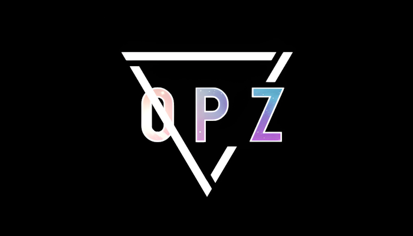
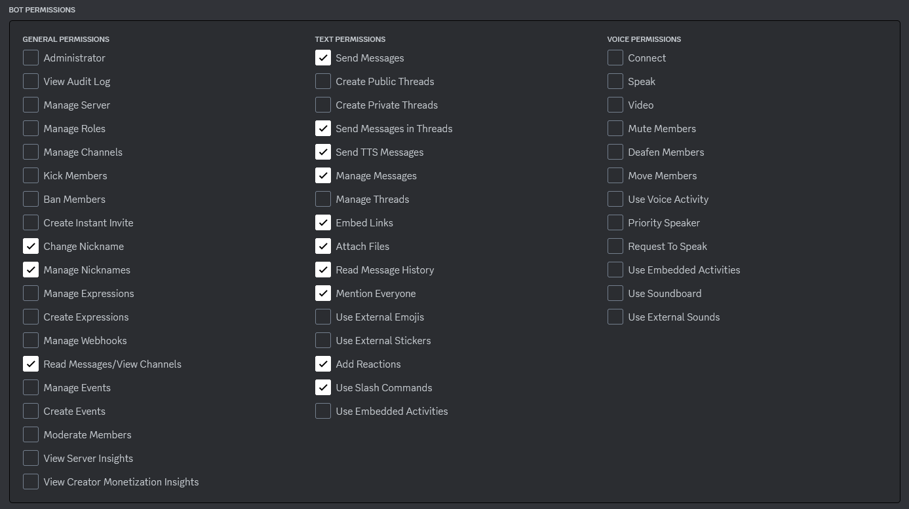

<h1 align="center">
   
  
   
   
  OPZBot
   
</h1>

<h4 align="center">A multipurpose Discord Bot for my server, built using <a href="https://github.com/discord-net/Discord.Net" target="_blank">Discord.Net</a>.</h4>

  
  
  
  
  
  

  <a href="#key-features">Key Features</a> •
  <a href="#how-to-use">How To Use</a> •
  <a href="#download">Download</a> •
  <a href="#credits">Credits</a>

## Key Features

* Backup of text channels to a database file
  - All of channel's messages.
  - Full file backup support without any file type limitations.
  - Blacklist specified users from being saved on the backup.

## How To Use

<h3>Prior to bot initialization</h3>  
<h4>Creating a Discord Bot User</h4>

* Go to Discord's [Developer Portal](https://discord.com/developers/applications)  
   
* Create a new application by clicking on the blue `New Application` button on the top right of the page  
  - *You can name it how you want.*  
   
* After creating and selecting your new application, go to the `Bot` tab on the left  
  - Click on `Reset Token` button and copy the generated token  
  - Note it for later, **don't share it nor place it where anyone could see it.**  
*Your bot's token can be used to gain total access to your bot user, thus having the possibility of making you the one responsible for any malicious content someone else is making it send*  
  - Scroll down to **Privillege Gateways Intents** section and then turn on all of the three intents.  
[refer to this for more information](https://discord.com/developers/docs/topics/gateway#gateway-intents)
   
* Go to **OAuth2** tab on the left, on the **URL Generator** option  
  - Check both the `bot` and `application.commands` checkboxes  
  - Now mark these checkboxes so that the bot have the necessary permissions  
      
     
  - Copy the Generated Url link on the bottom and paste it on your browser
  - Now select the desired server to invite de bot and authorize it  
***Done creating the bot user***  

<h4>Now you can start the installed OPZBot application on your machine</h4>

* Select the `[C] Config` option on the startup screen
  - Paste the token from early on the `[B] Token` option  
  - You can set the bot to consider the main admin role from your server by pasting [its id](https://www.itgeared.com/how-to-get-role-id-on-discord/#method-2-using-developer-mode) on `[A] Main admin role id`
  - For the backup purpose, it is needed to set your local default GMT value, which include negative values  
  - The general cooldown refers to limiting if you can make more than one backup per channel per day, it is recommended to leave it on `True`
   
* You can then return and select the `[R] Run` option  
---
<h3>After the bot is running</h3>  

* You can use [slash commands](https://support.discord.com/hc/en-us/articles/1500000368501-Slash-Commands-FAQ) to interact with the bot
  - A list of supported commands will be shown when you select the bot in the slash command dropdown
   
* All of the backed up messages will be stored in the `discord_backup.db` within the Backup folder found in the Bot's directory
  - You can also find the backed up files within the Backup folder

## Download

[Download](https://github.com/Haise777/OPZBot/releases/tag/latest) the latest version of OPZBot for Windows or Linux. 

## Credits

This software uses the following open source packages:

- [Discord.Net](https://github.com/discord-net/Discord.Net)
- [EF Core](https://github.com/dotnet/efcore)
- [Serilog](https://github.com/serilog/serilog)

---
OPZBot is released under [BSD 3-Clause license](https://opensource.org/license/bsd-3-clause/)

> *Contact me*\
> *Email:* [gashimabucoro@proton.me](mailto:gashimabucoro@proton.me) &nbsp;&middot;&nbsp;
> *Discord:* [@.haise_san](https://discord.com/users/374337303897702401)
